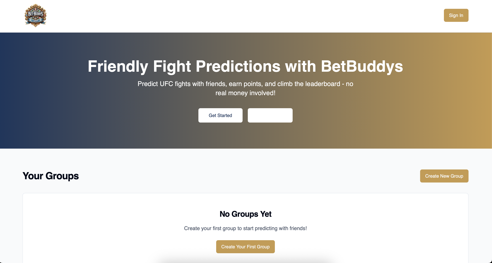
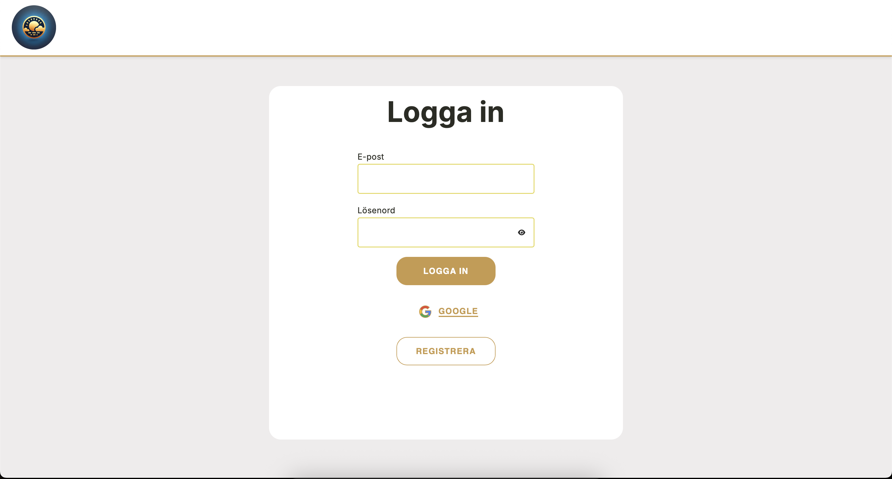

# Engaging Dev Profile Hub

A modern, interactive portfolio and CV site for Roman Divković.

## 🚀 About This Project

This site showcases Roman Divković's professional experience, projects, and skills in a visually engaging and interactive way. It features:

- A dynamic timeline of experience
- Project portfolio with detailed dialogs
- Contact form with email integration
- Responsive design and dark mode
- Animated UI and confetti effects

## 🛠️ Technologies Used

- **Vite** (build tool)
- **React** (UI library)
- **TypeScript** (type safety)
- **shadcn/ui** (component library)
- **Tailwind CSS** (utility-first styling)
- **Jest** & **React Testing Library** (unit tests)
- **Husky** & **lint-staged** (pre-commit hooks)
- **Prettier** & **ESLint** (code quality)
- **EmailJS** (contact form email delivery)
- **canvas-confetti** (browser confetti)
- **CircleCI** (continuous integration)

## ✨ Features & Showcases

- **Animated Timeline:** See career and education highlights in a scrollable, animated timeline.
- **Project Gallery:** Browse featured projects with images, tech stack, and links.
- **Contact Form:** Send a message directly from the site (with email delivery and confetti on success).
- **Responsive & Accessible:** Works great on all devices and supports keyboard navigation.
- **Dark/Light Mode:** Toggle between themes for comfortable viewing.

## 📦 Getting Started

### Prerequisites

- Node.js (v18+ recommended)
- npm (v9+ recommended)

### Installation

```sh
# 1. Clone the repository
git clone <YOUR_GIT_URL>
cd engaging-dev-profile-hub-main

# 2. Install dependencies
npm install

# 3. Create a .env file (for EmailJS)
cp .env.example .env
# Edit .env with your EmailJS credentials if you want to use the contact form

# 4. Start the development server
npm run dev
```

Visit [http://localhost:5173](http://localhost:5173) to view the site.

### Running Tests

```sh
npm test
```

### Linting & Formatting

```sh
npm run lint     # Check code style
npm run format   # Format code with Prettier
```

### Pre-commit & CI

- Pre-commit hooks run lint, format, and tests automatically.
- CircleCI runs all checks on every push.

## 🖼️ Screenshots




## 🙌 Credits

- Built by Roman Divković
- UI inspired by modern developer portfolios

---

Feel free to fork, star, and use as a template for your own portfolio!
